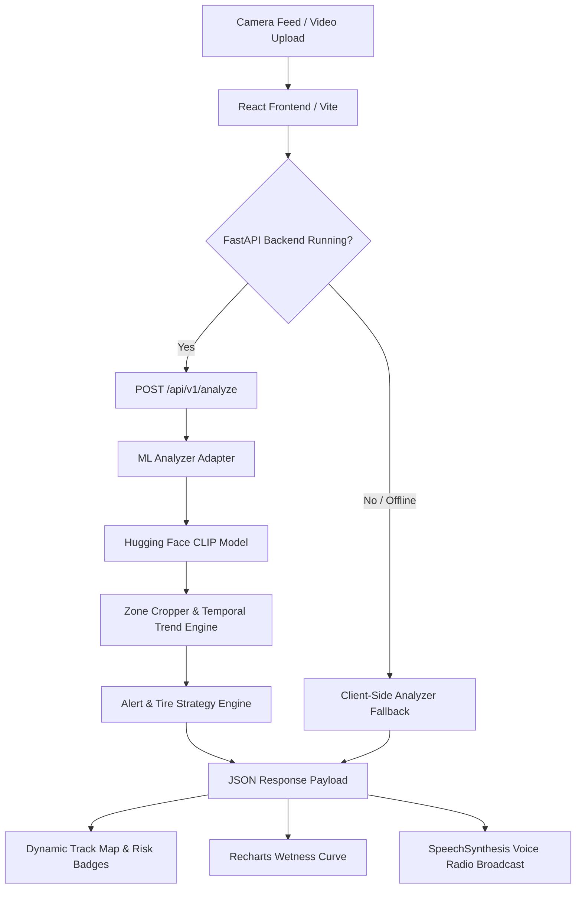

# 🏎️ GripLine — AI Track-Condition Co-Pilot

> **Grand Prix Hackathon Project** | An AI-powered real-time track condition co-pilot for pit wall race engineers, using computer vision, zero-shot Hugging Face CLIP classification, temporal trend analysis, dynamic tire strategy recommendations, and automated speech synthesis voice radio calls.

[](https://fastapi.tiangolo.com/)
[](https://reactjs.org/)
[](https://www.typescriptlang.org/)
[](https://www.python.org/)
[](https://huggingface.co/openai/clip-vit-base-patch32)
[](https://vitejs.dev/)
[](https://github.com/Satyam2307/GripLine)

---

## 📌 Overview

In high-speed motorsport like Formula 1, track wetness and drying lines change in real time. Delaying a tire pit stop by just one lap can cost a driver the race or lead to severe hydroplaning crashes.

**GripLine** processes live camera feeds or video clips of racing tracks to:
1. **Estimate Moisture**: Zero-shot classification using `openai/clip-vit-base-patch32`.
2. **Segment Corner Zones**: Crops 4 key corner sectors (`main_straight`, `turn_2`, `turn_4`, `final_corner`) to pinpoint localized hazards.
3. **Calculate Trends**: Applies single exponential smoothing ($\alpha = 0.35$) across temporal frames to detect **Drying**, **Stable**, or **Worsening** track trends.
4. **Recommend Strategy**: Deterministic tire recommendation engine (`Wet`, `Intermediate`, `Slick`) with crossover pit window alerts.
5. **Broadcast Radio Calls**: Synthesizes concise, race-engineer voice calls via the Web Speech API directly to the driver's headset.

---

## ⚡ Key Features

- 🎯 **Zero-Shot Vision Pipeline**: Powered by Hugging Face CLIP (`openai/clip-vit-base-patch32`) for classification of dry, damp, wet, and standing water surfaces.
- 🗺️ **Dynamic SVG Track Map**: Highlights corner risk levels (`Low Green`, `Damp Yellow`, `High-Risk Red`) with animated warning indicators.
- 📈 **Wetness Trend Curve**: Interactive multi-point historical chart powered by Recharts.
- 🎙️ **Automated Emergency Voice Radio**: Speaks engineer radio instructions automatically when wet hazards or tire windows occur, featuring animated red audio sound waves.
- 🛡️ **Tire Strategy Engine**: Deterministic recommendation engine evaluating overall wetness and localized corner risk modifiers.
- 🔌 **Client-Side Fallback Engine**: Guarantees zero downtime by executing smart client-side analysis when offline or deployed on static hosting.

---

## 🏗️ System Architecture



---

## 📁 Repository Structure

```
GripLine/
├── backend/                  # FastAPI REST API Backend
│   ├── app/
│   │   ├── main.py           # FastAPI entrypoint & CORS middleware
│   │   ├── config.py         # Application settings
│   │   ├── routes/           # REST endpoints (/health, /analyze)
│   │   └── services/         # Alert & Tire Strategy decision engines
│   ├── tests/                # Pytest test suite (41 tests)
│   └── requirements.txt      # Backend Python dependencies
├── frontend/                 # React 18 + Vite + TypeScript Dashboard
│   ├── src/
│   │   ├── App.tsx           # Telemetry Dashboard UI component
│   │   ├── index.css         # 3D 4K HD F1 Styling & Animations
│   │   ├── services/         # API fetch, UI adapter & client analyzer fallback
│   │   ├── types/            # GripLine TypeScript interfaces
│   │   └── mocks/            # Offline sample responses
│   ├── public/samples/       # 6 Track PNG sample feeds
│   ├── vercel.json           # SPA routing deployment config
│   └── package.json          # Frontend Node dependencies
├── ml/                       # Machine Learning Module
│   ├── inference.py          # HF CLIP zero-shot inference pipeline
│   ├── trend.py              # Temporal exponential smoothing engine
│   ├── mock_analyzer.py      # Fast synthetic analyzer
│   └── tests/                # ML Pytest test suite (68 tests)
├── contracts/                # Shared API Response Specification
└── pyproject.toml            # Root project metadata & pytest config
```

---

## 🚀 Quick Start Guide

### Prerequisites
- **Python 3.10+**
- **Node.js 18+** & **npm**

---

### 1️⃣ Run Backend (FastAPI)

```bash
# Navigate to backend directory
cd backend

# Install dependencies
pip install -r requirements.txt

# Run server with Uvicorn (Port 8000)
export GRIPLINE_MOCK=true
uvicorn app.main:app --reload --port 8000
```

> **API Health Check**: Open `http://localhost:8000/api/v1/health` or `http://localhost:8000/docs` in your browser.

---

### 2️⃣ Run Frontend (React + Vite)

```bash
# Navigate to frontend directory
cd frontend

# Install dependencies
npm install

# Start Vite dev server
npm run dev
```

> Open `http://localhost:5173` in your browser to access the telemetry dashboard.

---

### 3️⃣ Run Test Suites

```bash
# Run all 109 Backend & ML unit tests
export GRIPLINE_MOCK=true
python3 -m pytest backend/tests/ ml/tests/ -v
```

---

## 📡 API Reference

### `POST /api/v1/analyze`

**Request (`multipart/form-data`)**:
- `file`: Image (`PNG`/`JPEG`) or Video (`MP4`/`MOV`).
- `frame_stride` *(optional, default=5)*: Frame sampling interval.
- `max_frames` *(optional, default=30)*: Maximum frames to analyze.

**Response Schema (`200 OK`)**:
```json
{
  "session_id": "session_wet_01",
  "source": { "filename": "track_wet_01.png", "type": "image", "duration_seconds": 6.0 },
  "processed_frames": 1,
  "overall": {
    "base_condition": "Wet",
    "display_condition": "Worsening",
    "wetness_score": 0.865,
    "trend": "Worsening",
    "confidence": 0.88
  },
  "zones": [
    { "id": "main_straight", "name": "Main Straight", "wetness_score": 0.85, "risk": "High" },
    { "id": "turn_4", "name": "Turn 4", "wetness_score": 0.92, "risk": "High" }
  ],
  "recommendation": {
    "text": "Wet tires strongly recommended. Turn 4 standing water poses severe braking risk.",
    "suggested_tire": "Wet"
  },
  "radio_call": {
    "text": "Turn 4 and Turn 2 worsening with heavy surface water. Exercise extreme caution.",
    "severity": "high",
    "should_play": true
  }
}
```

---

## 🌐 Live Vercel Deployment

Deploy the frontend to Vercel in 1 click:
1. Import [`Satyam2307/GripLine`](https://github.com/Satyam2307/GripLine) on [Vercel](https://vercel.com).
2. Set **Root Directory** to `frontend`.
3. Framework Preset: **Vite** | Build Command: `npm run build` | Output Directory: `dist`.

---

## 👥 Credits & Hackathon Team

- **Repository**: [https://github.com/Satyam2307/GripLine](https://github.com/Satyam2307/GripLine)
- **Hackathon**: GRAND PRIX HACKATHON 🏁
- **Developer**: Satyam Chaurasia ([@Satyam2307](https://github.com/Satyam2307))
